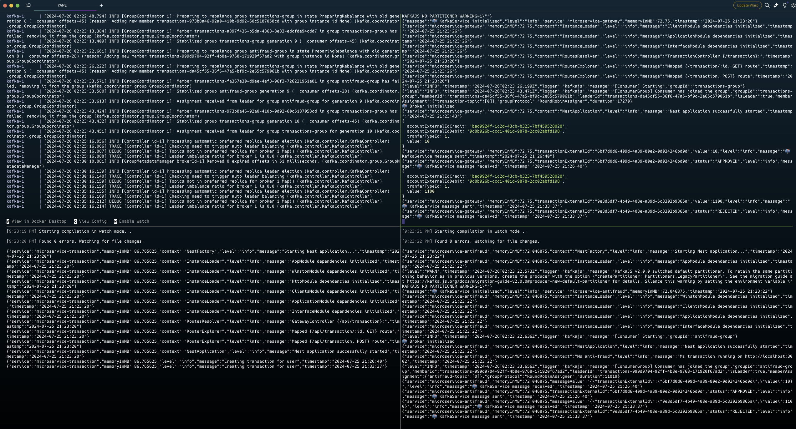

# Yape Code Challenge :rocket:

Our code challenge will let you marvel us with your Jedi coding skills :smile:. 

Don't forget that the proper way to submit your work is to fork the repo and create a PR :wink: ... have fun !!

- [Problem](#problem)
- [Tech Stack](#tech_stack)
- [Send us your challenge](#send_us_your_challenge)

# Problem

Every time a financial transaction is created it must be validated by our anti-fraud microservice and then the same service sends a message back to update the transaction status.
For now, we have only three transaction statuses:

<ol>
  <li>pending</li>
  <li>approved</li>
  <li>rejected</li>  
</ol>

Every transaction with a value greater than 1000 should be rejected.


# Tech Stack

<ol>
  <li>Node. You can use any framework you want (i.e. Nestjs with an ORM like TypeOrm or Prisma) </li>
  <li>Any database</li>
  <li>Kafka</li>    
</ol>

We do provide a `Dockerfile` to help you get started with a dev environment.

You must have two resources:

1. Resource to create a transaction that must containt:

```json
{
  "accountExternalIdDebit": "Guid",
  "accountExternalIdCredit": "Guid",
  "tranferTypeId": 1,
  "value": 120
}
```

2. Resource to retrieve a transaction

```json
{
  "transactionExternalId": "Guid",
  "transactionType": {
    "name": ""
  },
  "transactionStatus": {
    "name": ""
  },
  "value": 120,
  "createdAt": "Date"
}
```

## Optional

You can use any approach to store transaction data but you should consider that we may deal with high volume scenarios where we have a huge amount of writes and reads for the same data at the same time. How would you tackle this requirement?

You can use Graphql;

# Send us your challenge

When you finish your challenge, after forking a repository, you **must** open a pull request to our repository. There are no limitations to the implementation, you can follow the programming paradigm, modularization, and style that you feel is the most appropriate solution.

If you have any questions, please let us know.

# Solución

## Explicación
Para la solucion al reto se uso Nestjs, y algunas librerias para la conexion a la BD, a Kafka y el manejo de logs
se creo 3 microservicios, es decir se creo 3 proyectos de Nestjs
  - El primero se usa como un apigateway para los 2 restantes
  - El segundo es un microservicio para procesar las transacciones
  - El tercero es el microservicio de anti fraude


## Ejecución local
para levantar el proyecto basta con ejecutar cada uno de los proyectos acompañado del docker compose

para la base de datos, posicionarse en el proyecto de transaction y ejecutar

`npm run migrate`

y luego

`npm run generate`

para el docker compose:
`docker compose up`

para cada microservicio:
`npm run start:dev`

## Vistas previas
deberías verse algo como esto:


### Nota
cada proyecto tiene un archivo llamado .env.example, debes renombrarlo a .env estos ya estas previamente configurados con sus variables de entorno

## Pruebas

#### Con monto menor a 1000
ejecutamos un POST sobre /api/transaction


deberiamos ver esto en consola


validamos la BD


#### Con monto mayor a 1000
ahora validaremos con un monto superior a 1000


validamos la BD


revisamos la consola


#### Consultamos una transacion
la ultima prueba consiste en recuperar una transaccion
